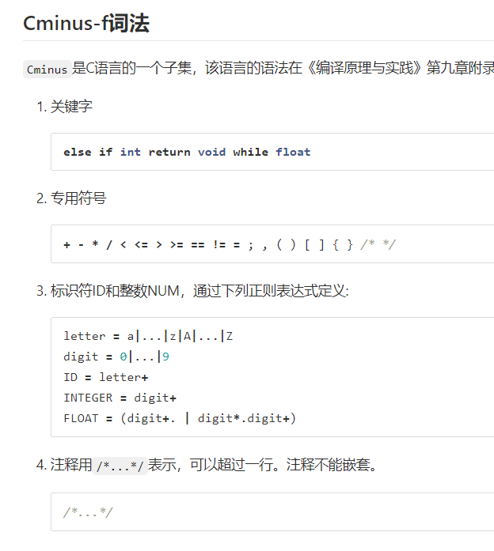
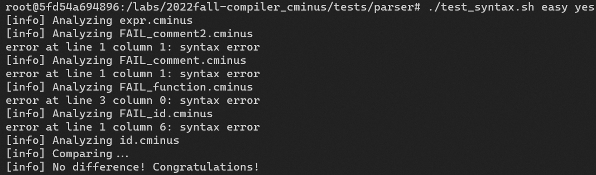
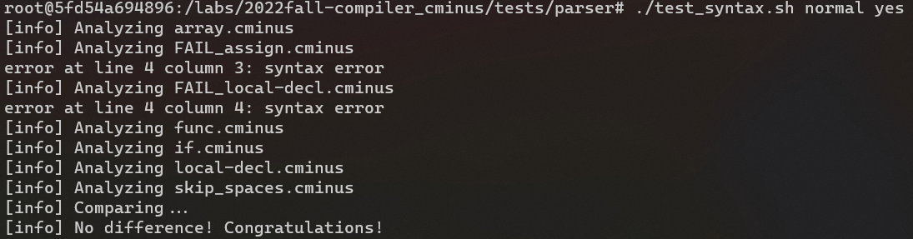
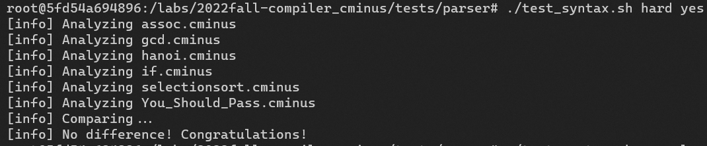

# lab1 实验报告
学号 PB20081594 姓名 孙晨阳

## 实验要求
从无到有完成一个完整的Cminus-f解析器，包括基于flex的词法分析器和基于bison的语法分析器

## 实验难点
### 一、理解实验要做什么
这个实验虽然有着实验要求，但是还是总觉得目标不够清晰，不知道自己在做什么。现在回过头来，才明白为什么自己做实验的时候总是很慢总是容易出bug。
这个实验分为两部分，第一部分为分词，即通过flex的match规则，准确识别并分类出各种各样的词。第二部分为构建语法分析树，这部分由三处需要修改，一为语法分析树节点的类型，二为token类别，三为写出语法分析的产生式。
现在回过头来，觉得实验文档写的十分的清晰明了，但是在刚写的时候，却表示完全看不懂。
觉得此实验用一种层次化的思想来做，首先就是明白从宏观上自己要做什么，而不是一开始直接看各种各样的资料，之后再慢慢细化，现用现查要用的资料。而不是像在一开始那样，看各种知识点，最终连自己要做什么都不清楚。
### 二、理解flex和bison的运行机制
针对我们要修改的部分，首先是flex的模式+动作。首先什么是模式，模式就是自己定义的能够匹配相应字符串的规则。由于flex是分词，所以你要定义一系列的模式，对于给定的任意字符串全部都能够分解，不能存在未被分解的字符串。而在实验基础知识的这里
就会明白该如何进行分词，分词的种类有哪些。之后具体的操作就依据Flex-regular-expressions即可。对于动作而言仿照示例即可。
对于bison要构建一个语法分析树，重点在于理解bison是怎样运行的。对于分析树的每一个节点，它们的节点类型是未定义的，因此需要定义一个节点类型。然后就是分析树的分支节点和叶子节点是两种不同的节点，这个不同体现在，叶子节点是经由flex分词产生的词法种类（即终结符），而分支节点是定义在bison中的非终结符。因此bison要写的部分的框架已经清晰明了了，首先是定义分析树节点的数据类型，然后是定义分析树节点的名称，最后是补充分析树的分支规则（产生式）。
### 三、学会flex和bison的写法
flex的写法在于模式+动作，根据示例即为 
```
Flex-regular-expressions { action ; }
```
这里比较难的点就是注释的正则表达式匹配，其在文档中并没有任何提示，只能自己写。
觉得bison大部分写法都十分易懂，唯一有一点没有提及给我造成了巨大困惑的是，\$\$, \$1,...两点难以理解，一是它到底代表着谁，最后明白了\$\$代表产生式最左端的节点，\$1代表产生式从左数第二个， ... 。另外一个比较困惑的点是它总是在make时报错，后来才明白，是因为虽然指定了节点，但并没有指定节点在union中选择哪个数据类型。对于这样有两种处理方式，一是在前面写
```
%type <node> name
```
二是写成\$\<node\>\$的形式
### 四、报错定位难
比如union的数据类型未定义，但是报错的位置确实在lexical_analyzer.l文件里面。
比如syntax error的错误可能是由于语法错误，也可能是由于词法错误，但是最终报错都是syntax error，因此就只能一点点找，调试起来非常麻烦。
等等
## 实验设计
由于此实验由助教所设计，因此仅在此处阐述一下实验的大致逻辑，且此处的陈述与前面的实验难点有部分重合
个人觉得原本应该是实验最难的一部分应当是这个分析树的框架，所幸这一部分由助教们完成了。
本次实验采用bison和flex结合，flex负责词法部分，主要为bison提供token，bison负责语法部分，主要负责语法分析树的构建。本次实验的大部分工作由助教编写和bison、flex两个包代替，极大地减轻了学生的工作量。
学生写的部分为词法的匹配规则编写，语法分析树节点数据类型的定义，语法分析树节点的名称和数据类型选择，语法分析树的推导规则。
## 实验结果验证
### easy难度下脚本测试结果

### normal难度下的脚本测试结果

### hard难度下的脚本测试结果


## 实验反馈
#### 1.\$\$, \$1, \$2...难以理解
觉得实验中这些符号即便给了范例但还是没有很清晰的理解他们到底表示什么意思
感觉在网上搜到的一个解释比较好，就是\$\$指代产生式左边的节点，\$1指代的是推导出来第一个节点，然后依次。
#### 2.对parser的理解没有很强的加深
感觉只是在盲目的按照实验文档一步步填写，只是加深了对正则表达式还有flex，bison书写方式的了解。关键是由于flex，bison运行在幕后，我就不是很清楚它是怎样根据我的规则具体地一步步实现parser的，只知道我定义了这些规则，然后它就动了emmm
觉得可以更加侧重于flex，bison是处理我给出的这些数据的方式