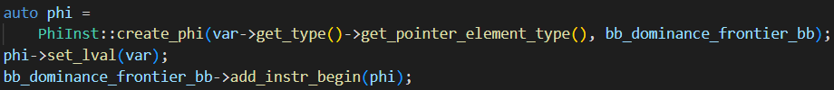
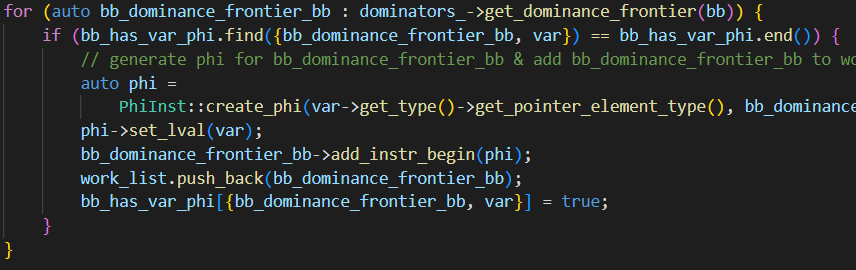
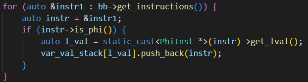
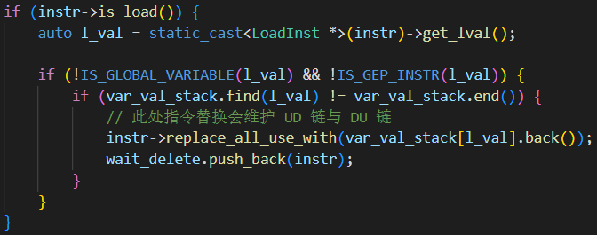
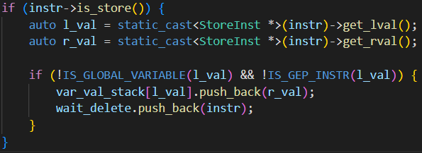
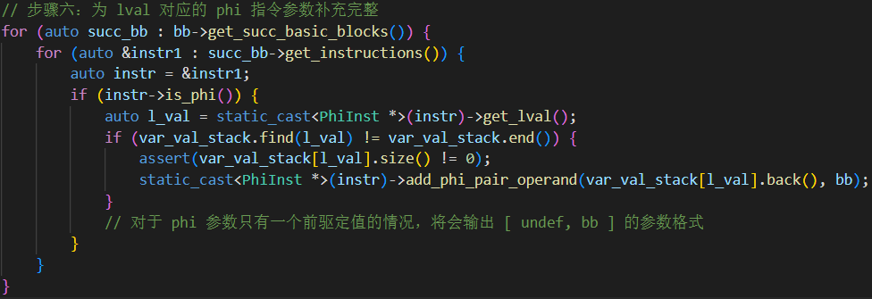
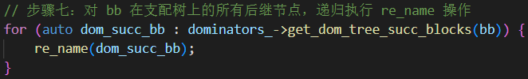
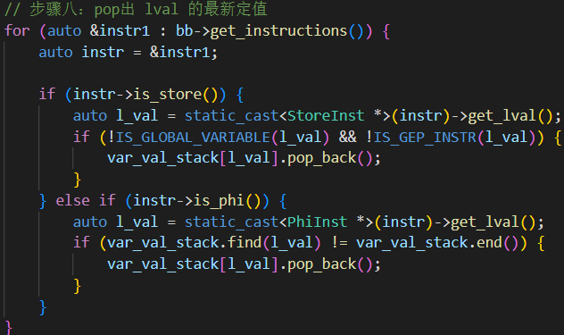

# Lab4.1 实验报告

## 实验要求

理解SSA静态单赋值形式, 并通过阅读相关材料了解SSA的相关概念和半剪枝静态单赋值形式, 通过阅读Mem2Reg.cpp等代码了解是在SSA下是如何通过放置$\phi$函数和rename程序块来完成对冗余`load`, `store`指令删除来提升代码效率的

## 思考题
### Mem2reg
1. 请简述概念：支配性、严格支配性、直接支配性、支配边界
   - 支配性:从初始结点起, 每条到达n的路径都要经过d, 写成d dom n, 称d支配b

   - 严格支配性:当且仅当$m\in DOM(n)-\{n\}$时, 称m严格支配n

   - 直接支配性:严格支配b的结点集$DOM(b)-\{b\}$中与b最接近的结点称为b的直接支配结点, 记为$IDOM(b)$

   - 支配边界:对于一个结点n, 满足

     - n支配m的一个前驱($q\in preds(m)$且$n\in Dom(q)$)
     - n不严格支配m($n\notin Dom(m)-\{m\}$)

     将上述相对于n具有这种性质的结点m的集合称为n的支配边界, 记作DF(n)

2. `phi`节点是SSA的关键特征，请简述`phi`节点的概念，以及引入`phi`节点的理由。

   - **概念**: 在静态单赋值形式中, 在汇合处将不同路径上的静态单赋值形式名调和为一个名字的函数, 叫做`phi`
   - **理由**: 静态单赋值形式要求每个使用处都引用了一个定义, 为了满足静态单赋值的规则, 在CFG中每个汇合点, 必须将不同的静态单赋值形式名调和为一个名字, 因此引入`phi`结点, 用于在汇合点处调和为一个名字

3. 观察下面给出的`cminus`程序对应的 LLVM IR，与**开启**`Mem2Reg`生成的LLVM IR对比，每条`load`, `store`指令发生了变化吗？变化或者没变化的原因是什么？请分类解释。

   - `func`函数中的`load`,`store`指令全部被去掉
     原因:`func`中传递的参数`x`, 是一个局部变量, 所有关于`x`的`load`, `store`在Mem2Reg中指会被全部用来维持一个关于`x`的最新的值, 而用最新的值代替了`load`, `store`的作用
   - `main`函数中关于变量`b`的`load`, `store`指令全部被去掉
     原因:`main`中的`b`是一个局部变量, 关于`b`的`load`, `store`指令在Mem2Reg中指会被全部用来维持一个关于`b`的最新的值, 而用最新的值代替了`load`, `store`的作用
   - `main`函数中关于数组变量`arr`的`load`, `store`指令未变化
     原因:`arr[5]`的地址是采用`getelementptr`指令计算的
   - `main`函数中关于全局变量`globVar`的`load`, `store`指令未变化
     原因:`globVar`是全局变量

4. 指出放置phi节点的代码，并解释是如何使用支配树的信息的。（需要给出代码中的成员变量或成员函数名称）

   - 放置phi节点的代码
     
     第一个语句创建了一个phi节点
     第二个语句设置phi节点的值为`var`
     第三个语句在`bb_dominance_frontier_bb`(即worklist中bb的支配边界中的基本程序块)中的起始处插入`phi`节点

   - 如何使用支配树的信息
     
     - **获得支配树的信息**:访问Mem2Reg类中的私有变量指针`dominators_`, 此指针指向了一个支配树的实例, 利用`Dominators`的`get_dominance_frontier`方法可以获取`bb`结点的支配边界, 即DF(bb) (此处即获得了支配树的信息)
     - **遍历支配边界**:通过遍历bb的支配边界中的基本程序块(在代码中为`bb_dominance_frontier_bb`), 再利用已经构建好的`bb_has_var_phi`数据结构判断基本程序块是否插入了`phi`节点
     -  **支配边界的基本程序块中插入phi节点**:调用`bb_dominance_frontier_bb`的`add_instr_begin`方法, 向当前基本程序块中的起始处插入`phi`节点
     - **将支配边界中的基本程序块插入WorkList中**: 具体代码为`work_list.push_back(bb_dominance_frontier_bb)`

5. 算法是如何选择`value`(变量最新的值)来替换`load`指令的？（描述清楚对应变量与维护该变量的位置）
   (1). 首先维护了一个全局名字集合值的栈`var_val_stack`
   (2). 先遍历`bb`中的所有指令, 如果发现`phi`节点, (由`phi->set_lval(var)`可知,`phi`节点的值最初为一个全局名字), 则将`var_val_stack`中`phi`节点有关的全局名字的栈中压入`phi`节点作为最新的值
   

   (3). 重新遍历bb中的所有指令, 如果`load`指令在`store`指令之前, 且`load`指令的值是一个全局名字, 则从`var_val_stack`中取出最新的值替换load指令来维护UD链和DU链

   (4). 如果当前遍历的指令是`store`指令, 且被存入的地址是一个全局名字, 则将`store`指令即将要存入的值存入`var_val_stack`中作为全局名字的最新的值
   

   (5). 遍历当前块之后的后继块, 如果后继块中存在`phi`节点, 则补充完成`phi`节点的参数
   

   (6). 如果当前`bb`在支配树上有后继节点, 则在当前维护好的`var_val_stack`上继续`rename`后继节点(保证后继节点如果没有新的定义的话仍能使用之前块的最新的值)
   

   (7). 当前bb及其在支配树上的所有后继节点全部rename结束之后, 对`var_val_stack`在本块中入栈的值全部退栈, 保证别的块不会误用全局名字的最新值
   

### 代码阅读总结

我是在一开始先读的关于SSA的阅读材料, 可以说读的是相当的云里雾里, 根本不知道为什么要这样做, 这样做与我删除冗余`load`, `store`指令有什么关系。随着阅读代码, 渐渐了解了SSA的转换算法的具体代码实践。

- **统计全局名字集合**:阅读材料中SSA算法是针对类似C语言有具体变量名的, 但是IR并没有变量名, 或者说每一个值都是一个与众不同的值, %1%2等等。在IR中唯一标识了一个变量的, 就是这个变量的地址, 即最初为局部变量`alloca`出的一个空间。而局部变量定义的地方, 即`store`指令所在。由上述便可以通过遍历`store`指令统计全局名字集合
- **插入phi指令**:这部分与阅读材料中的算法差不多, 都是遍历全局名字的所在块, 然后获得块的支配边界, 向起始处插入`phi`指令
- **重命名**:阅读材料的重命名部分用了计数器, 栈, 全局名字新下标等一系列操作, 而在代码上就比较简单了, 首先是对每一个全局名字维护了一个`vector`类型的栈, 如果是`store`指令则在高级语言中表现为新定义, 需要更新栈上的最新值, 对于`load`则需要用最新的值维护DU链和UD链
- **清除冗余指令**:通过维护一个DU链和UD链, 使得局部非数组变量的`load`, `store`功能被替代, 等价我可以用高级语言记录局部变量的值, 然后在IR的需要值的地方用记录的值替换掉一些不必要的变量, 因此对于优化后的IR, `load`和`store`已经没有必要使用, 就可以删除, 同时可以删除的还有局部变量的`alloca`

### 实验反馈 （可选 不会评分）

